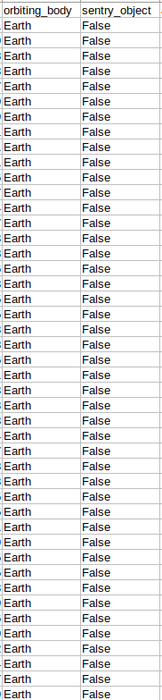

# Using-GridDB-to-analyze-asteroids-distance-from-Earth-and-why-it-is-important.
Data Analysis on Asteroids Distance from Earth


In this article, we will use GridDB to analyse how scientists decide whether or not asteroids are dangerous to Earth, that is, whether or not they will leave their orbit and land here on Earth, potentially harming the population.

**Exporting and Importing dataset using GridDB:**

GridDB is a highly scalable and optimized in-memory No SQL database that allows parallel processing for higher performance and efficiency, especially for time-series databases. We will be using GridDB's node js client, which allows us to connect GridDB to node js and import or export data in real-time.

These are the columns that are present in our dataset:

1. id : ID given to the asteroids by NASA scientists.
2. new_name : Names given to the asteroids by NASA scientists.
3. est_diameter_min : The minimum estimated diameter of the asteroids.
4. est_diameter_max : The maximum estimated diameter of the asteroids.
6. relative_velocity : The relative velocity of the asteroids compared to Earth.
7. miss_distance : Asteroids' distance away from the Earth.
8. orbiting_body: Asteroids' orbital around the specific body.
9. sentry_object: Whether the asteroid collided with other body (satellites, etc) in the space.
10. absolute_magnitude: The magnitude of force by which they would hit the Earth according to their mass-force ratio.
11. hazardous : Are the asteroids at hazardous range? (Outcome Variable)


To upload the dataset to GridDB, we would read the CSV file that contains the data which is taken from [This Kaggle Dataset](https://www.kaggle.com/datasets/sameepvani/nasa-nearest-earth-objects)

Now, we will create a GridDB container to pass our database schema to the GridDB to be able to generate the design of the database before inserting the row information. Next, we would insert our data into the GridDB. We have now successfully exported the dataset to the GridDB platform. 

On the other hand, to import the dataset from the GridDB platform, we will use TQL, GridDB's query language similar to SQL. We will create a container and store the fetched data in it. The next step would be to extract the rows in order of the column info and save it into a data frame to use for data visualization and analysis.

For the data visualization and analysis, we will be using the following library for NodeJS.

* DanfoJS - For working with DataFrames


```javascript

var griddb = require('griddb_node');

const createCsvWriter = require('csv-writer').createObjectCsvWriter;
const csvWriter = createCsvWriter({
  path: 'out.csv',
  header: [
    {id: "id", title:"id"}, 
    {id: "new_name", title:"new_name"}, 
    {id: "est_diameter_min", title:"est_diameter_min"}, 
    {id: "est_diameter_max", title:"est_diameter_max"}, 
    {id: "relative_velocity", title:"relative_velocity"}, 
    {id: "miss_distance", title:"miss_distance"}, 
    {id: "orbiting_body" , title:"orbiting_body"}, 
    {id: "sentry_object", title:"sentry_object"}, 
    {id: "absolute_magnitude", title:"absolute_magnitude"}
  ]
});

const factory = griddb.StoreFactory.getInstance();
const store = factory.getStore({
    "host": '239.0.0.1',
    "port": 31999,
    "clusterName": "defaultCluster",
    "username": "admin",
    "password": "admin"
});

// For connecting to the GridDB Server we have to make containers and specify the schema.
const conInfo = new griddb.ContainerInfo({
    'name': "neoanalysis",
    'columnInfoList': [
      ["name", griddb.Type.STRING],
      ["id", griddb.Type.INTEGER],
        ["new_name", griddb.Type.STRING],
        ["est_diameter_min", griddb.Type.DOUBLE],
        ["est_diameter_max", griddb.Type.DOUBLE],
        ["relative_velocity", griddb.Type.DOUBLE],
        ["miss_distance", griddb.Type.DOUBLE],
        ["absolute_magnitude", griddb.Type.DOUBLE]
    ],
    'type': griddb.ContainerType.COLLECTION, 'rowKey': true
});


// ////////////////////////////////////////////


const csv = require('csv-parser');

const fs = require('fs');
var lst = []
var lst2 = []
var i =0;
fs.createReadStream('./Dataset/neo.csv')
  .pipe(csv())
  .on('data', (row) => {
    lst.push(row);
    console.log(lst);

  })
  .on('end', () => {
    var container;
    var idx = 0;
    
    for(let i=0;i<lst.length;i++){


    store.putContainer(conInfo, false)
        .then(cont => {
            container = cont;
            return container.createIndex({ 'columnName': 'name', 'indexType': griddb.IndexType.DEFAULT });
        })
        .then(() => {
            idx++;
            container.setAutoCommit(false);
            return container.put([String(idx), lst[i]['id'],lst[i]["new_name"],lst[i]["est_diameter_min"],lst[i]["est_diameter_max"],lst[i]["relative_velocity"],lst[i]["miss_distance"],lst[i]["absolute_magnitude"]]);
        })
        .then(() => {
            return container.commit();
        })
       
        .catch(err => {
            if (err.constructor.name == "GSException") {
                for (var i = 0; i < err.getErrorStackSize(); i++) {
                    console.log("[", i, "]");
                    console.log(err.getErrorCode(i));
                    console.log(err.getMessage(i));
                }
            } else {
                console.log(err);
            }
        });
    
    }
    store.getContainer("neoanalysis")
    .then(ts => {
        container = ts;
      query = container.query("select *")
      return query.fetch();
  })
  .then(rs => {
      while (rs.hasNext()) {


          let rsNext = rs.next()

          lst2.push(
            
            
            {
                'id': rsNext[1],
                "new_name": rsNext[2],
                "est_diameter_min": rsNext[3],
                "est_diameter_max": rsNext[4],
                "relative_velocity": rsNext[5],
                "miss_distance": rsNext[6],
                "absolute_magnitude": rsNext[7],
            
            }
            
          );
          
      }

        csvWriter
        .writeRecords(lst2)
        .then(()=> console.log('The CSV file was written successfully'));

      return 
  }).catch(err => {
      if (err.constructor.name == "GSException") {
          for (var i = 0; i < err.getErrorStackSize(); i++) {
              console.log("[", i, "]");
              console.log(err.getErrorCode(i));
              console.log(err.getMessage(i));
          }
      } else {
          console.log(err);
      }
  });   
  
  });

```


**Data Analysis:**

We now check and load our dataset to conduct data analysis.


Because orbiting_body and sentry_object have redundant values throughout the column and no unique value to aid us in our analysis, we would omit these two columns from our analysis, as shown below.



We would load the csv file into the DataFrame variable(df) as shown below:

```javascript

let df = await dfd.readCSV("./out.csv")
```

Starting with our data analysis, we would first check the number of rows and columns in our dataset


We have 90836 rows and 8 columns.

```javascript

console.log(df.shape)

//  Output
// [ 90836, 8 ]
```

Now to see the names of the columns after omitting two columns, as mentioned above, and the data types of the columns to get the idea of what the data represents:
```javascript

console.log(df.columns)

// Output
// ['id','new_name', 'est_diameter_min', 'est_diameter_max', 'relative_velocity', 'miss_distance', 'absolute_magnitude', 'hazardous']
```

```javascript
df.loc({columns:['id',
'new_name',
'est_diameter_min',
'est_diameter_max',
'relative_velocity',
'miss_distance','absolute_magnitude',
'hazardous']}).ctypes.print()

//  Output
// ╔══════════════════════╤═════════╗
// ║ id                   │ int64   ║
// ╟──────────────────────┼─────────╢
// ║ new_name             │ object  ║
// ╟──────────────────────┼─────────╢
// ║ est_diameter_min     │ float64 ║
// ╟──────────────────────┼─────────╢
// ║ est_diameter_max     │ float64 ║
// ╟──────────────────────┼─────────╢
// ║ relative_velocity    │ float64 ║
// ╟──────────────────────┼─────────╢
// ║ miss_distance        │ float64 ║
// ╟──────────────────────┼─────────╢
// ║ absolute_magnitude   │ float64 ║
// ╟──────────────────────┼─────────╢
// ║ hazardous            │ bool    ║
// ╚══════════════════════╧═════════╝
```


